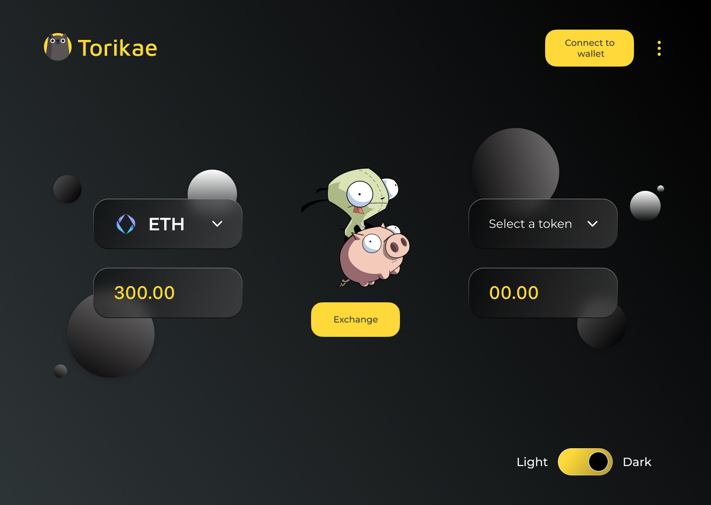

# Torikae
### A Simple way to DeFi

## Authors

This project was made by the following authors:-
1. Bhaskar Dutta (Blockchain Backend)
2. Abhik Banerjee (Frontend and Solana Development)
3. Ishika Majumdar (UI/UX)

## Steps to follow

1. `npm install`
2. `npm start`

## Project Info

The frontend was made using **React 17** and **MUI v5** and has Light/Dark Modes. The UI/UX Designs were made using **Figma**. A better Mobile optimized UI is in the works.

## Light Mode

1. **Landing**

2. **Dribble**

## Dark Mode

1. **Landing**

2. **Dribble**

